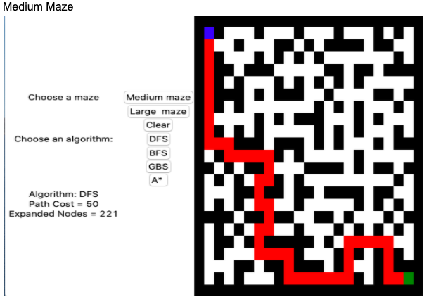

# Maze_Search

### General Information

The idea is that there is a "Pacman" agent that needs to find paths through mazes. Implemented several search algorithms and apply them to the given pathfinding scenario. Using Python we developed the search algorithms and visualization

There is an implementation of the following search algorithms

- Depth-fist search

- Breadth first search

- Greedy best first search

- A* Heuristic Search

The algorithms can run on a medium or large sized maze and it is visualized using Tkinter graphics user interface

For each problem instance and each search algorithm, the GUI shows:
1. The solution on a red path, the initial point which is the green square, and the destination which is a blue square.
2. The path cost of the solution, defined as the number of steps taken to get from the
initial state to the goal state.
3. The number of nodes expanded by the search algorithm.

**Example**



### How to Run

Clone the repository

Open terminal or Command line to the project directory

Run

```
cd src
python main.py
```
